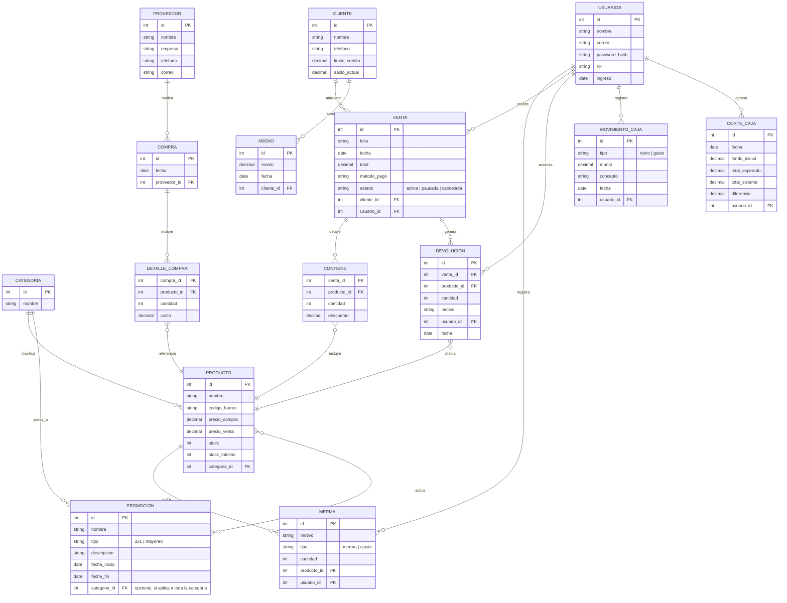

# Diagrama Entidad-Relación (DER)

```mermaid
erDiagram
    CATEGORIA ||--o{ PRODUCTO : clasifica
    PROVEEDOR ||--o{ COMPRA : realiza
    COMPRA ||--o{ DETALLE_COMPRA : incluye
    DETALLE_COMPRA }o--|| PRODUCTO : referencia

    PRODUCTO ||--o{ MERMA : sufre
    USUARIOS ||--o{ MERMA : registra

    USUARIOS ||--o{ VENTA : realiza
    CLIENTE ||--o{ VENTA : adquiere
    VENTA ||--o{ CONTIENE : detalle
    CONTIENE }o--|| PRODUCTO : incluye

    VENTA ||--o{ DEVOLUCION : genera
    DEVOLUCION }o--|| PRODUCTO : afecta
    USUARIOS ||--o{ DEVOLUCION : autoriza

    CLIENTE ||--o{ ABONO : abona

    USUARIOS ||--o{ MOVIMIENTO_CAJA : registra
    USUARIOS ||--o{ CORTE_CAJA : genera

    PRODUCTO }o--o{ PROMOCION : aplica
    CATEGORIA ||--o{ PROMOCION : aplica_a

    CATEGORIA {
        int id PK
        string nombre
    }

    PRODUCTO {
        int id PK
        string nombre
        string codigo_barras
        decimal precio_compra
        decimal precio_venta
        int stock
        int stock_minimo
        int categoria_id FK
    }

    PROVEEDOR {
        int id PK
        string nombre
        string empresa
        string telefono
        string correo
    }

    COMPRA {
        int id PK
        date fecha
        int proveedor_id FK
    }

    DETALLE_COMPRA {
        int compra_id FK
        int producto_id FK
        int cantidad
        decimal costo
    }

    MERMA {
        int id PK
        string motivo
        string tipo "merma | ajuste"
        int cantidad
        int producto_id FK
        int usuario_id FK
    }

    USUARIOS {
        int id PK
        string nombre
        string correo
        string password_hash
        string rol
        date ingreso
    }

    CLIENTE {
        int id PK
        string nombre
        string telefono
        decimal limite_credito
        decimal saldo_actual
    }

    ABONO {
        int id PK
        decimal monto
        date fecha
        int cliente_id FK
    }

    VENTA {
        int id PK
        string folio
        date fecha
        decimal total
        string metodo_pago
        string estado "activa | pausada | cancelada"
        int cliente_id FK
        int usuario_id FK
    }

    CONTIENE {
        int venta_id FK
        int producto_id FK
        int cantidad
        decimal descuento
    }

    DEVOLUCION {
        int id PK
        int venta_id FK
        int producto_id FK
        int cantidad
        string motivo
        int usuario_id FK
        date fecha
    }

    MOVIMIENTO_CAJA {
        int id PK
        string tipo "retiro | gasto"
        decimal monto
        string concepto
        date fecha
        int usuario_id FK
    }

    CORTE_CAJA {
        int id PK
        date fecha
        decimal fondo_inicial
        decimal total_esperado
        decimal total_sistema
        decimal diferencia
        int usuario_id FK
    }

    PROMOCION {
        int id PK
        string nombre
        string tipo "2x1 | mayoreo"
        string descripcion
        date fecha_inicio
        date fecha_fin
        int categoria_id FK "opcional, si aplica a toda la categoria"
    }
```
